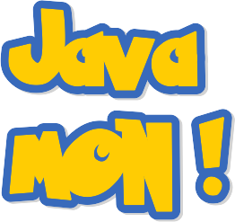
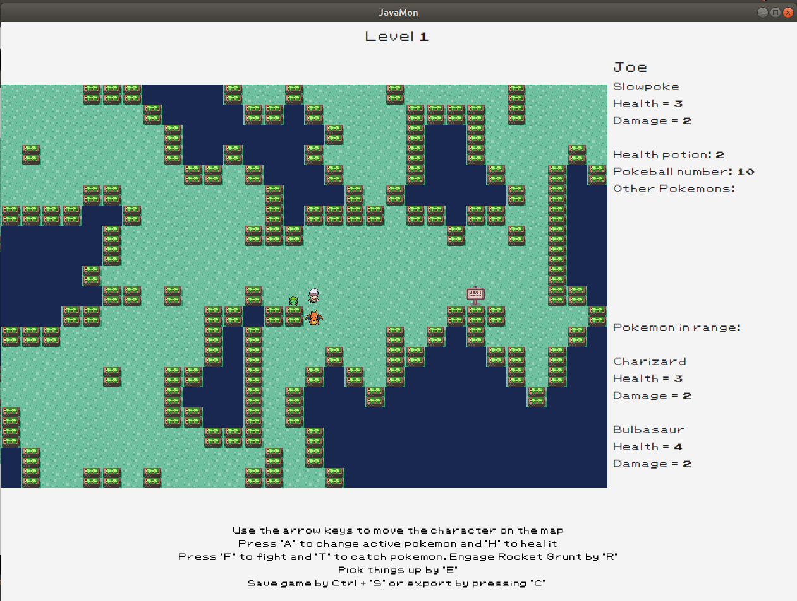

# javaMON! - Dungeon Crawler Game

## Story

This game allows you to step into the shoes of Ash and explore two levels while trying to capture pokemons and ultimately defeat the Rocket Grunt.

####How to catch pokemons?

You can try simply throwing pokeballs at them. Depending on the pokeball's strength, you may catch it without engaging in a fight. But pokeballs are scarce resources (found in some lootboxes)!

Alternatively, you can fight the pokemon too. But beware that it will fight back and your damage value does not guarantee that amount of damage, merely sets the upper limit to a random number. If the health of your enemy decreases to 0, you can catch it by throwing a pokeball. The pokemon on the board move on their own, and each type has a distinctive movement pattern, they may follow you!

When you defeat a pokemon, the damage value of the one you used to fight it increases - your pokemon develops.

If you manage to catch a pokemon, it will appear in your inventory, and you can choose that in a subsequent fight (press 'A' to change active pokemon). If you have health potions in your inventory, you can also heal your active pokemon after a fight (press 'H').

####Levels

There is an "info board" somewhere on level 1. You need to get that to be able to unlock the door to level 2.

####End of the game

The game ends if you defeated all pokemons of the Rocket Grunt (waiting for you on level 2), or if you lose all of your pokemons on your journey.

## Main features
### Saving gamestate
The app allows you to save a (very close to complete) game state. The physical layout itself, the pokemons on the field (including all their attributes like health and damage) will be retained, as well as your inventory, with the pokemons you have already captured, the available pokeballs, health potions and your key to the next level (if already obtained)! 

What is more, you can select *how* you want to preserve your game:
1. Save to PostgreSQL database
2. Export to json so that you can take your game with you and continue at a friend's place, maybe? Very nineties..

### Loading previous game
You can pick up where you left off. You can load a game from the database (identified by username, savename and date) or import it from your json file.

### Randomly generated, resizeable game field

No two games are the same! 

For every game, new maps are created randomly, with walls delimiting the watery, off-limits areas. You may find yourself on a really hard to navigate field if luck brings it.

Generating the game field programmatically also means that you can change it's size if you would like to roam larger areas. What is more, if the game field is bigger than the game window, your avatar can gradually uncover places that are out of sight at first.

### Wanna cheat?
Using the developers' names as username (Balázs, Dani, Fruzsi or Peti) you will be able to cut corners by moving through walls.

## Layout
The window consists of a header displaying the level the player is currently at. The main pane depicts the game field, below are hints about key mappings. The top right pane shows the player's inventory. All relevant game events are reported below, e.g. details of pokemon in fight range, items to pick up, the content of opened lootboxes.

